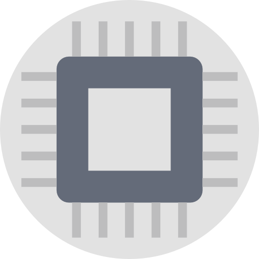

# GPGPU and Accelerator Programming

The GPGPU and accelerator programming module focused on GPU APIs and parallel compute available through GPUs. It was assessed in two parts both of which were programming assignments. This was a really fun module as it really was a crash course in GPUs and GPU programming which was great to fill in gaps on any pre-existing knowledge and to gain new knowledge on other technologies that many people had not covered.

## Assignment

So as mentioned the assignment was in two parts.

#### Part 1

Part one was to output a set of complex numbers from the mandelbrot set. We were given some basic C++ code that did this and were told to port it to CUDA to make it more effecient. We then had to write a report setting out the improvements made. We were also expected to record data timings as well for referencing in the report.

#### Part 2

Part two was to perform a unsharp filter on a given image. With this assignment we were allowed to use any GPU API apart from CUDA. However in this part we were given a list of additional tasks we could implement to gain extra marks these were:

* Utilise shared/local memory as a cache for data-reuse 
* Exploit fixed-function graphcs hardware via OpenCL images and bilinear filtering
*  Interactive graphical visualisation of varying blur radii

## Submission

Describe submission

#### Part 1

I managed to complete part 1 rather easily with a 5x speed improvement with a 16k image over the previous version. I also added unit tests to test for an indentical output to the original code. Note when benchmarking I benchmarked the entire program so GPU memory transfers were considered if I were to remove the memory transfers and writing image from the program the speed up would have been even larger.

#### Part 2

For part 2 I implemented the assignment using OpenCL as unlike CUDA I could run it on any computer and not just NVidia approved hardware. In additional to implementing the unsharp mask with a 1100x speed up with a blur radius of 35 I also developed two additional applications a PPM viewer, which allowed me to view the output of the program and a Visualiser which allowed me to view the changes in real time when altering blur radii. I also met the fixed function graphics hardware requirement by using OpenCL images.

## License 

Apache 2.0