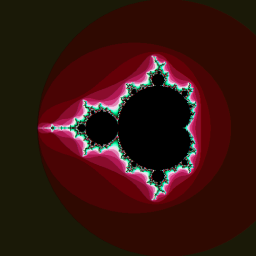

# GPGPU and Accelerator Programming

Lorem ipsum dolor sit amet, consectetur adipiscing elit. Vestibulum malesuada lacus dui, sed blandit enim porta eu. Suspendisse quis aliquet mi, eget pellentesque nisi. Vivamus id viverra felis, quis lobortis velit. Cras vitae molestie justo. Vivamus ultricies, lacus at fermentum laoreet, tellus mauris placerat orci, id consequat felis ligula ac dolor. Donec faucibus leo ante, in viverra odio pharetra nec. Cras mattis tellus non lacinia cursus. Aliquam erat volutpat. Pellentesque habitant morbi tristique senectus et netus et malesuada fames ac turpis egestas. Maecenas vitae justo purus.

# Part-1

Lorem ipsum dolor sit amet, consectetur adipiscing elit. Vestibulum malesuada lacus dui, sed blandit enim porta eu. Suspendisse quis aliquet mi, eget pellentesque nisi. Vivamus id viverra felis, quis lobortis velit. Cras vitae molestie justo. Vivamus ultricies, lacus at fermentum laoreet, tellus mauris placerat orci, id consequat felis ligula ac dolor. Donec faucibus leo ante, in viverra odio pharetra nec. Cras mattis tellus non lacinia cursus. Aliquam erat volutpat. Pellentesque habitant morbi tristique senectus et netus et malesuada fames ac turpis egestas. Maecenas vitae justo purus.

## CPU Version

Lorem ipsum dolor sit amet, consectetur adipiscing elit. Vestibulum malesuada lacus dui, sed blandit enim porta eu. Suspendisse quis aliquet mi, eget pellentesque nisi. Vivamus id viverra felis, quis lobortis velit. Cras vitae molestie justo. Vivamus ultricies, lacus at fermentum laoreet, tellus mauris placerat orci, id consequat felis ligula ac dolor. Donec faucibus leo ante, in viverra odio pharetra nec. Cras mattis tellus non lacinia cursus. Aliquam erat volutpat. Pellentesque habitant morbi tristique senectus et netus et malesuada fames ac turpis egestas. Maecenas vitae justo purus.

## CUDA Version

Lorem ipsum dolor sit amet, consectetur adipiscing elit. Vestibulum malesuada lacus dui, sed blandit enim porta eu. Suspendisse quis aliquet mi, eget pellentesque nisi. Vivamus id viverra felis, quis lobortis velit. Cras vitae molestie justo. Vivamus ultricies, lacus at fermentum laoreet, tellus mauris placerat orci, id consequat felis ligula ac dolor. Donec faucibus leo ante, in viverra odio pharetra nec. Cras mattis tellus non lacinia cursus. Aliquam erat volutpat. Pellentesque habitant morbi tristique senectus et netus et malesuada fames ac turpis egestas. Maecenas vitae justo purus.

## Output

Once you have built the executables you can just run them from a terimal. The two parameters you pass represent the width and the height nothing to complex. Below is the output of the program.

```
gpu-mandelbrot 4096 4096 // Generated using CUDA
cpu-mandelbrot 4096 4096 // Generated using CPU
```


# Part-2

TBC